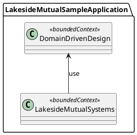

# Domain-Driven Design Library

This library is a collection of interfaces and abstract classes to express domain-driven design concepts in Java code. Most types in this library are pure marker interfaces and only for documentation purposes. An added benefit is that IDEs can show all implementations of an interface, thus making it easy to discover all implementations of for example Value Objects or Entities.

## Pattern representations 

<!-- Future work: feature Context Map with Lakeside Mutual services as Bounded Contexts and this library as a shared kernel 

--->

| Pattern (or Variant)              | Implementation in this library | Example from Lakeside Mutual |
| -------------------- | ------------------------------ |------------------------- |
| Layered Architecture | n/a | Top-level packages in Lakeside Mutual backend represents the layers suggested by E. Evans in the ["light blue" book](http://dddcommunity.org/book/evans_2003/) |
| Module               | n/a  | Java sub-packages in Domain Layer of Lakeside Mutual backends |
| Entity               | [Entity](src/main/java/org/microserviceapipatterns/domaindrivendesign/Entity.java) | [CustomerProfileEntity](https://github.com/Microservice-API-Patterns/LakesideMutual/tree/master/customer-core/src/main/java/com/lakesidemutual/customercore/domain/customer/CustomerProfileEntity.java) |
| Value Object         | [ValueObject](src/main/java/org/microserviceapipatterns/domaindrivendesign/ValueObject.java)  | [PolicyPeriod](https://github.com/Microservice-API-Patterns/LakesideMutual/tree/master/policy-management-backend/src/main/java/com/lakesidemutual/policymanagement/domain/policy/PolicyPeriod.java) |
| Service              | [Service](src/main/java/org/microserviceapipatterns/domaindrivendesign/Service.java)  | See layer-specific variants below: |
| Application Service  | [ApplicationService](src/main/java/org/microserviceapipatterns/domaindrivendesign/ApplicationService.java)  | [CustomerService](https://github.com/Microservice-API-Patterns/LakesideMutual/tree/master/customer-core/src/main/java/com/lakesidemutual/customercore/application/CustomerService.java) |
| Domain Service       | [DomainService](src/main/java/org/microserviceapipatterns/domaindrivendesign/DomainService.java)  | [InteractionLogService](https://github.com/Microservice-API-Patterns/LakesideMutual/tree/master/customer-management-backend/src/main/java/com/lakesidemutual/customermanagement/domain/InteractionLogService.java) |
| Infrastructure Service| [InfrastructureService](src/main/java/org/microserviceapipatterns/domaindrivendesign/InfrastructureService.java)  | [CustomerCoreService](https://github.com/Microservice-API-Patterns/LakesideMutual/tree/master/customer-management-backend/src/main/java/com/lakesidemutual/customermanagement/infrastructure/CustomerCoreService.java) |
| Repository           | [Repository](src/main/java/org/microserviceapipatterns/domaindrivendesign/Repository.java) | [CustomerRepository](https://github.com/Microservice-API-Patterns/LakesideMutual/tree/master/customer-core/src/main/java/com/lakesidemutual/customercore/infrastructure/CustomerRepository.java) |
| Factory              | [Factory ](src/main/java/org/microserviceapipatterns/domaindrivendesign/Factory.java) | [CustomerFactory](https://github.com/Microservice-API-Patterns/LakesideMutual/tree/master/customer-core/src/main/java/com/lakesidemutual/customercore/domain/customer/CustomerFactory.java) |
| Aggregate            | [Aggregate](src/main/java/org/microserviceapipatterns/domaindrivendesign/Aggregate.java) | [CustomerAggregateRoot](https://github.com/Microservice-API-Patterns/LakesideMutual/tree/master/customer-core/src/main/java/com/lakesidemutual/customercore/domain/customer/CustomerAggregateRoot.java) |
| Bounded Context      | [BoundedContext](src/main/java/org/microserviceapipatterns/domaindrivendesign/BoundedContext.java) | CustomerCoreApplication	 |
| Context Map          | n/a | n/a	 |
| Subdomain patterns   | n/a | n/a |

<!-- Should we also feature Subdomains? tbd (see what IDDD book has to say and does in sample app) -->

## More Information
[This website](https://www.ifs.hsr.ch/index.php?id=15666&L=4) collects pointers to DDD resources, for instance:

* This [DDD reference](http://domainlanguage.com/ddd/reference/) has pattern summaries.
* The [DDD community](http://dddcommunity.org/learning-ddd/what_is_ddd/) features supporting material.
* [InfoQ](https://www.infoq.com/domain-driven-design) provides articles and presentaions around DDD.

### DDD Example(s)
This DDD library was developed for the [Lakeside Mutual](https://github.com/Microservice-API-Patterns/LakesideMutual) sample application.

The [DDD Sample Application](https://github.com/citerus/dddsample-core) that implements the running example in Eric Evans' [Domain-Driven Design](https://domainlanguage.com/ddd/) is also available on GitHub. It deals with cargo booking, routing and tracking.

The [agile project management sample](https://github.com/VaughnVernon/IDDD_Samples) accompanying [Implementing Domain-Driven Design](http://www.informit.com/store/implementing-domain-driven-design-9780321834577) by Vaughn Vernon can be found on GitHub as well. 
